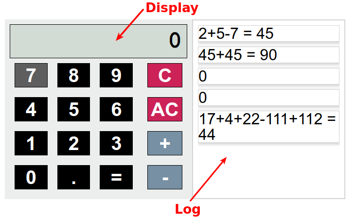

# Trabajo final 1ª evaluación

## Funcionalidad

En este ejercicio debes programar una calculadora. El HTML y CSS de la calculadora
son los que vienen en este ejercicio. Debes eliminar los párrafos de ejemplo del log
contenidos entre comentarios pero **no puedes realizar ninguna otra modificación al HTML**.

Si has de hacer alguna modificación ha de ser dinámicamente mientras la aplicación se
ejecuta. No se admitirán cambios a los fuentes HTML o CSS.

La calculadora tiene el siguiente aspecto:



Ha de funcionar de la siguiente forma:
- Al pulsar un número su valor se añadirá a la derecha del display
  superior. Si había únicamente un cero se sustituirá el cero por ese
  número.
- El botón "." no hace nada, está estropeado.
- Al pulsar el "+" o el "-":
  - Si el último elemento del display era un número se añade el operando a la
    derecha del display.
  - Si el último elemento del display no era un número, no hará nada. Esto
    es para evitar que se puedan construir operaciones como "2+-+++5"
- Al pulsar el botón "=":
    - Se sustituirá el contenido del display por el resultado de evaluar
      la expresión que hay en el display. Debes programar una función que calcule
      el resultado a partir de la cadena, no puedes utilizar `eval`.
    - Se añadirá al log la expresión que había en el display añadiendo " = <resultado de la operación>"
    - Si había un número, se añadirá al log ese número
- El botón "C" borra el contenido actual del display de la
  calculadora y lo pone a "0"
- El botón "AC", además de lo anterior, borra el log de la
  calculadora.

La calculadora debe funcionar con valores de tipo `Number`, no hace falta que utilices valores `BigInt`

## Entorno de desarrollo

- **Todo** el código HTML, CSS y js estará en el directorio `src`.
- **Todas** las pruebas estarán en el directorio `test`

Además de programar el código, deberás montar un entorno de desarrollo con Webpack.
Debe admitir tres scripts:
- `yarn test` ejecutará las pruebas de la aplicación con Jest
- `yarn start` lanzara webpack-dev-serve con autoreloading
- `yarn build` generará los ficheros distribuibles de la aplicación en el directorio `dist`

Se debe transformar el código usando el preset `preset-env` de Babel.

Se debe poder probar la aplicación en desarrollo con `yarn start`

Se debe poder lanzar la aplicación y funcionar correctamente con el código generado
en `dist`. **No** incluyas ese código en tu entrega, debe poder generarse automáticamente
con `yarn build`

Deberás incluir la dependencia "core-js" ya que si no te puede dar en ocasiones
el error `Cannot find module 'core-js/modules/web.dom-collections.iterator.js'`

## Pruebas

Debes incluir un juego de pruebas para asegurar la corrección de tu código.

No hace falta que pruebes que los manejadores han sido instalados correctamente.
Lo que debes probar es que el resultado de la función que invocaría el manejador es correcto.

  Por ejemplo, si tienes:
  ```js
  function hazAlgo() { ... }
  boton.addEventListener('click', hazAlgo)
  ```
Lo que tienes que probar es que `hazAlgo()` hace lo que corresponde. No hace falta
que envíes un click al botón y pruebes el resultado.

## Entrega

Debes entregar un único fichero zip con el nombre `[NOMBRE]_[APELLIDO1].zip`
(sustituye NOMBRE y APELLIDO1 por tu nombre y tu primer apellido)

El fichero debe
contener el código fuente y la configuración necesaria para ejecutar el proyecto.
Se debe poder descomprimir en un directorio, ejecutar `yarn install` y tras eso
ya deberían poder utilizarse los scripts `yarn test`, `yarn start` y `yarn build`
sin necesidad de ningún paso adicional.

No incluyas `node_modules`, el directorio `dist`, etc.

## Criterios de evaluación

- El programa es correcto, realiza la función que se solicita en el enunciado.
- Se han utilizado estructuras del lenguaje adecuadas: bucles, condicionales, operadores, etc.
- Se han utilizado variables y constantes de forma adecuada.
- Se utilizan correctamente y cuando corresponda los tipos de datos y objetos predefinidos del lenguaje (Arrays, objetos planos, Map, Set, etc.)
- Se han utilizado funciones para estructurar el código, definiendo y utilizando parámetros y valores de respuesta de forma adecuada.
- El programa es lo más sencillo posible para realizar su función.
- No existe código repetido: se han extraído los comportamientos comunes a funciones y se ha intentado hacer el código genérico.
- Se han creado pruebas para validar la funcionalidad del código utilizando las validaciones adecuadas.
- Se han estructurado las pruebas de forma correcta.
- El entorno de desarrollo está configurado correctamente.
